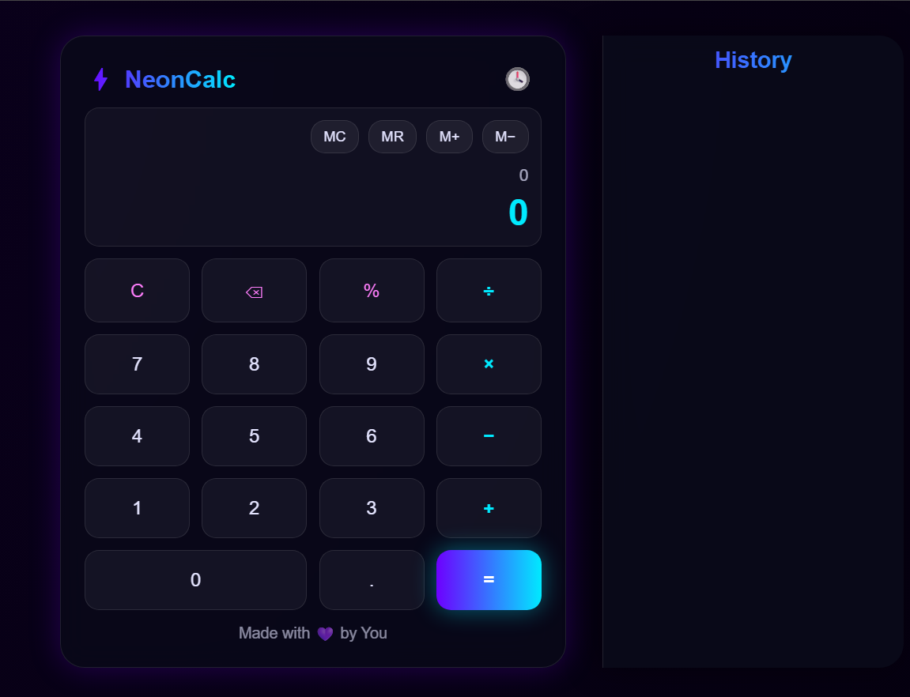

#  Neon Calculator

A sleek and modern calculator app designed with a **vibrant neon theme**.  
It combines functionality and style — making everyday calculations glow with energy 

---

##  Features
-  **Neon UI:** A glowing, futuristic interface that pops in dark mode.  
-  **Basic Operations:** Perform addition, subtraction, multiplication, and division easily.  
- **Responsive Design:** Works smoothly across all screen sizes.  
-  **Smooth Animations:** Buttons and display transitions for a fluid user experience.  

---

##  Preview
  

---

##  Tech Stack
- **HTML5**  
- **CSS3 (Neon Theme Styling)**  
- **JavaScript (Logic and Interactivity)**  

---

##  How to Use
1. Open the app in your browser.  
2. Use the glowing buttons to perform your calculations.  
3. Enjoy the neon vibes while you calculate!  

---

##About the Project
This project was created as a fun way to combine **UI design** with **basic JavaScript logic**, resulting in a clean, glowing, and interactive calculator.

---

## License
This project is open-source and free to use. Feel free to modify and improve it!

---

Made with 💚 by [SUJAL SINGH]
